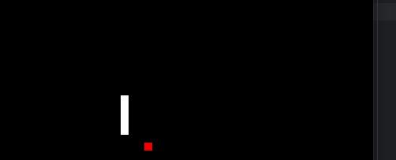

<h1 align="center">🐍 Snake Game in Python</h1>

  Classic Snake game made with Python and Pygame. Control the snake with arrow keys and eat red apples to grow!

---

<h2>🎮 How to Play</h2>
<ol>
  <li>Install <strong>Python 3</strong> on your computer.</li>
  <li>Install <strong>Pygame</strong>:
    <pre><code>pip install pygame</code></pre>
  </li>
  <li>Run the game:
    <pre><code>python snake.py</code></pre>
  </li>
  <li>Use the arrow keys to move the snake:
    <ul>
      <li>⬆️ Up</li>
      <li>⬇️ Down</li>
      <li>⬅️ Left</li>
      <li>➡️ Right</li>
    </ul>
  </li>
</ol>

---

<h2>🖼️ Screenshots / GIF</h2>

  

---

<h2>⚡ Features</h2>
<ul>
  <li>Snake grows when eating apples.</li>
  <li>Continuous movement.</li>
  <li>Self-collision detection (game over).</li>
  <li>Screen wrapping at edges.</li>
</ul>

---

<h2>🛠️ Technologies</h2>
<ul>
  <li>Python 3</li>
  <li>Pygame</li>
</ul>

---

<h2>👤 Author</h2>

  Valentín Mansilla 
  <a href="https://www.linkedin.com/in/valentin-mansilla-154a5028b/" target="_blank">LinkedIn</a> |
  <a href="https://github.com/valemmp" target="_blank">GitHub</a>

