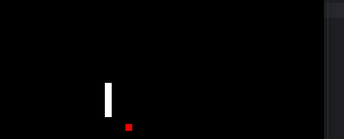

# Snake Game en Python

Un juego clásico de Snake hecho en Python usando Pygame.

El objetivo es conseguir puntos comiendo las manzanas y hacer crecer la serpiente sin chocar contra sí misma.

## Cómo ejecutarlo

Necesitás tener Python 3 instalado.

Primero instalá Pygame:

pip install pygame

Después ejecutá:

python snake.py

## Controles

Usá las flechas del teclado para mover la serpiente:

- Flecha arriba
- Flecha abajo
- Flecha izquierda
- Flecha derecha

## Algunas características

- La serpiente crece al comer manzanas.
- La serpiente se mueve continuamente.
- El juego termina si la serpiente choca contra sí misma.
- La pantalla tiene un sistema de wrap-around: al salir por un borde, la serpiente aparece por el lado opuesto.

## Captura

---

Este fue uno de mis primeros proyectos en Python y lo hice para practicar la lógica básica de un juego y familiarizarme con Pygame.
